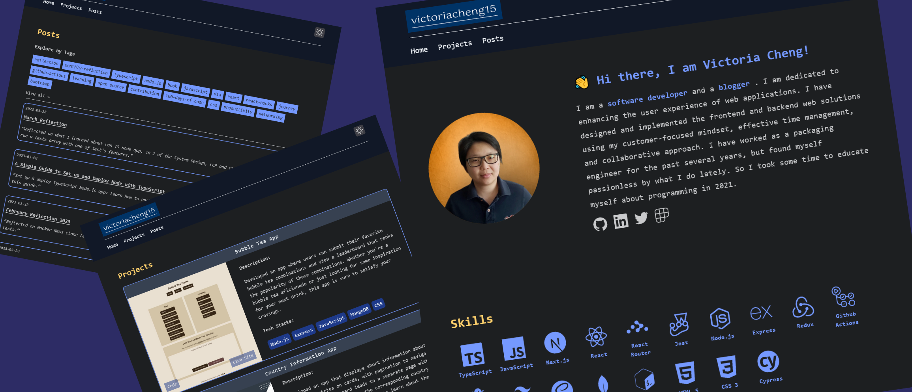

# personal blog site

This site is based on the [Astro Cactus](https://astro.build/themes/details/astro-cactus/) design.

## victoriacheng15.vercel.app

- Framework: [Astro](https://astro.build/)
- Styling: [Tailwind CSS](https://tailwindcss.com/)
- Content: [Markdown](https://www.markdownguide.org/)
- Deployment: [Vercel](https://vercel.com/)

## Project Overview

- `public/*` - static assets included robots.txt
- `src/components/*` - all the components for the site
- `src/content/*` - blog posts
- `src/data/*` - contains global data about the site
- `src/data/*` - contains global data about the site
- `src/layout/*` available layouts to use on each page
- `src/pages/*` - all pages
- `src/styles/*` - global styles
- `src/utils/*` - functions to sort posts and format time
