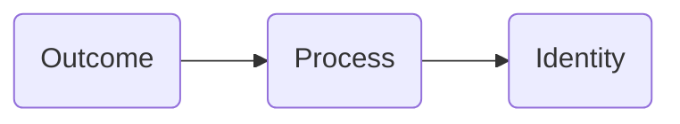
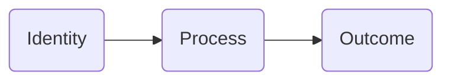
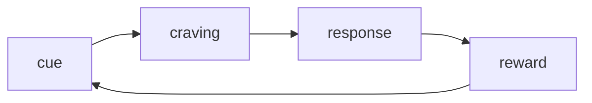
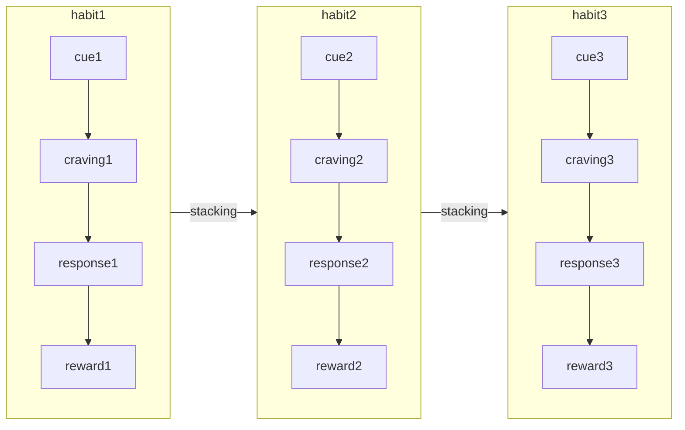

> Atomic Habits: An Easy & Proven Way to Build Good Habits & Break Bad Ones

Author: [James Clear](https://jamesclear.com/atomic-habits).

**Personal note:**

So far, I have read a couple of chapters and I even re-read some chapters to see if I miss anything or not. This book is a very well-written guide on how to change your habits and get 1% better every day. I have gotten ideas on why good habits don't stay with you, while bad habits are always staying with you. This book also opens up my mind and see things differently.

**I highly recommended purchasing this book.**

Remember, "Rome was not built in one day". It takes time to understand and master something like skill, habit, etc. I resonated with this [newsletter](https://jamesclear.com/lay-a-brick) a lot

## Chapter 1

The author described the change as slow very well by using an ice cube as an example. Imagine the ice cube is on the table with a temperature of 25 degrees. No change in the ice cube and the temperature is slowly increasing by 1 degree. Nothing happens at 26 degrees. 27 degrees, 28, 29, 30, 31, and still nothing happens. Until 32 degrees, the ice cube begins to melt. As you can see 1-degree shift, doesn't show any difference, but until it reaches a point where it will unlock a huge change. In short, building a good habit takes time.

> There is a phrase, "Roman wasn't built in a day"

- Forgot about goals, focus on systems instead for better results.
- Habits are like the atoms of our lives.
- Getting 1 percent better every day counts for a lot in the long term.
- Habits are a double-edged sword. They can **work for** or **against** you.
- Small changes often appear to make no difference until you reach a certain threshold.

## Chapter 2

Changing habits is challenging for two reasons, 1)we try to change the wrong thing, and we try to change our habits in the wrong way.

Three layers of behaviour change:

- First: change your outcomes
  - Like change result: weight loss, published books, etc
    - Associate with goals
- Second: change your process
  - Like change result: implement a new route, decluttering desk
    - Associate with habits
- Third: change your identity
  - Like change beliefs: worldview, self-image, judgment
    - Associate with beliefs, assumptions, biases

Outcomes are what you get. Processes are what you do. Identify what you believe.

**Outcome-based habits:**

**Identity-based habits:**

> You have a new goal and a new plan, but you have not changed who you are.
>
> By James Clear

Identity change process:

- Decide the type of person you want to be
- Prove it to yourself with small wins.

To make a change and build up good habits, go deep to the core aka the identity. Believe that you are `insert your identity` and ask yourself what `identity` person would do. Then work and build up from there.

e.g. If you want to be a healthy person, ask yourself `what would a healthy person do?` in certain situations, and then use this as a guide to lead you.

## Chapter 3

A habit is a behaviour that has been repeated enough times to become automatic.

The process of building a habit can be divided into 4 steps: cue, craving, response, and reward.

The cue triggers your brain to initiate a behaviour.
Cravings are the motivational force.
The response is the actual habit you perform.
The reward is to satisfy your craving and teach us.

Let's say, the room is dark (_the cue_) and you can't see anything. But you want to see everything (_the craving_). So you look for a flip switch (_the response_). Once the flip switch is found, turn on the light (_the reward_). This is one of the simplest examples that we are doing it often enough to become automatic.

**The habit loop:**

## Chapter 4

Before we can effectively build new habits, we need to get a handle on current ones. This could be challenging. There is a process called pointing and calling that calls out certain things and raises awareness.

The more automatic a behaviour becomes, the less likely we are to consciously think about it.

Get to the habit scorecard. You write down what are your daily activities in order from waking up to sleep. Once the list is written and looks at each of them.

- Write `+` if it is a good habit.
- Write `-` if it is a bad habit.
- Write `=` if it is a neutral habit.

**A list of habits:**

- Turn off alarm --> =
- Check the phone --> -
- Drink a cup of water --> +
- Go to bathroom --> +
- Eat breakfast --> +
- Open up computer --> +
- and more

If it is difficult to determine how to rate certain habits, ask yourself:

- Does this behaviour help me become the type of person I wish to be?
- Does this habit cast a vote for or against my desired identity?

Also, use the `point and call` process to raise awareness of what are you about to do.

- Good habits --> positive outcome
- Bad habits --> negative outcome

## Chapter 5

To keep up with a new habit, you need to make a specific plan for when and where you will be performing a new habit, and the new habit is more likely to follow through.

Don't just say `I am going to eat healthier`. Because we never say when and where to make these habits HAPPEN.

Do this instead:

I will `behaviour` at `the time` in `location`.

e.g:

- I will meditate for one minute at 7 a.m. in my kitchen.
- I will read a book for 30 minutes before sleeping in my bed.

Building a new habit is to identify a current habit you already do each day and then stack your new behaviour on top. This is called `habit stacking`

The formula for this is:
After `the current habit`, I will `new habit`.

e.g:

- After taking off my work shoes, I will immediately change into my workout clothes.
- After I pour my cup of coffee each morning, I will meditate for one minute.

**The key is to tie your desired behavior into something you already do each day.**

This [Diderot effect](https://en.wikipedia.org/wiki/Diderot_effect) is interesting to read and related to this chapter.

Remember habit loop? Now you stack new habits on top of existing habits!

## Chapter 6

Environment plays a role that will trigger the cue for certain habits. So, if you want to continue making good habits, rearrange the environment with objects and/or contexts that will help you to form good habits.

> Whenever possible, avoid mixing the context of one habit with another. When you start mixing contexts, you will start mixing habits and the easier ones will usually win.

**Personal experience:**
I came to the US when I was 16 years old. I knew little to nothing about English and American Sign Language (ASL). I went to the deaf school and lived in the dorm where all people use English and ASL. Furthermore, I couldn't communicate with them. The surrounding environment was new, and I had to learn both languages at the same time to be able to communicate with them. Within a month of the environment, I started picking up both languages. In the end, I was able to communicate with them at the dorm and the school.

The environment is a powerful thing that can shape or form good habits, as well as bad habits. Since it influences how you engage with the world. Alter the environment where you can expose to positive cues that will trigger good habits, and reduce exposure to negative cues that will trigger bad habits.

e.g. if you are working from home, set a room as your office space if possible. Only work-related happen in the office, while personal-related happen outside the office. This is to help you stop work after the clock.

## Chapter 7

Self-control is a way to resist bad habits, however, it is a short-term strategy. You know, how do we keep our good habits? These cues are the triggers for these habits. To keep and repeat these good habits, make these cues **OBVIOUS**, which is the `1st Law of Behaviour Change`. Also, you can create an environment where you can easily trigger and have good habits.

How do we break away from bad habits for long-term strategy? We will be doing the opposite of the 1st Law of Behaviour Change. This means we will make cues that trigger bad habits **INVISIBLE** and reduce exposure to cues.

With both actions, these bad habits are likely to fade away until the cue reappears.

For example: if you are spending too much time on video games, unplug the console and put it in a closet after each use. Can't see the console, and you are less likely to spend more time playing video games.

> Once a habit has been encoded, the urge to act follows whenever the environmental cues reappear.

> Make the cues of your good habits obvious and the cue of your bad habits invisible

## Chapter 8

How to make a habit irresistible? Make it attractive, which is the 2nd law of Behaviour change. Do you know how we like certain things more than others? It is because we are attracted to them.

To increase the odds that a certain behaviour will happen, make it attractive. This could be hard. Will need to figure out and understand what are the cues and the cravings.

Temptation bundling is something that you find out attractive and want to keep doing. It could be a reward for something that you would like to do after a certain habit.

You also could combine the temptation bundling with habit stacking. The formula: After [current habit], I will [habit I need]. After [habit I need], I will [habit I want].

E.g.
After I get my morning coffee, I will be building an app with x tech stacks `(need)`. After I am done with a couple of tasks from the to-do list of the app, I will watch an episode of the show `(want)`.

After I pull out my phone, I will do ten burpees `(need)`. After I do ten burpees, I will check Twitter `(want`)`.

The reward shall be something that you want to do the most and this makes the habit very ATTRACTIVE!

## Chapter 9

Family and friends are one of the factors that will shape/form your habits. We usually imitate the habits of three groups: `the close`, `the many`, and `the powerful`.

The close:

Usually the environment or people around you. We pick up habits from the people we spend the most time with. Beware of peer pressure, it could be bad but depends. To make habits more attractive, you can join a culture where your desired behaviour is the normal behaviours and something in common with the group.

The many:

Usually the society you are in. It could be good or bad. The normal behaviour of the tribe often overpowers the desired behaviour of the individual. It is similar to something traditional that has been passed down from generation to generation. If one generation doesn't do certain traditional things, then it could mean challenging the tribe and this means change is unattractive. On the other hand, if the change is fitting in the tribe, then the change is very attractive.

The powerful:

Usually, the people who are powerful or similar. Let’s say you want to be an Olympics swimmer, you probably would look up to Michael Phelps or a swimmer from your country. Or Be a celebrity, you would look up to the celebrity you like.

In the end, we desired something from someone, and we usually learn from them and then maybe twerk it to fit our needs.

If a behaviour can get us approval, respect, and praise, we find it attractive

> If a behaviour can get us approval, respect, and praise, we find it attractive

## Chapter 10

How to find and fix the causes of your bad habits?

The cue is always the thing that triggers your habits, regardless of good or bad. Also, the craving will fuel the desire you do the habits.

> The specific cravings you feel and habits you perform are an attempt to address your fundamental underlying motive.

If a habit successfully addresses a motive, you develop a craving to do it again.

How to reprogram your brain to enjoy hard habits? You can make hard habits more attractive if you can learn to associate them with a positive experience. Maybe need a slight mindset shift.

To summarize, habits are attractive when we associate them with positive feelings and unattractive when we associate them with negative feelings (the opposite of the 2nd Law of Behaviour Change - make it unattractive).

## Chapter 11

Walk slowly, but Never Backward, the idea behind this is better to make a slow, steady process toward your goals than to take a few steps forward and then fall back into old habits or behaviours. It takes time for habits to become ingrained.

> Habit formation is the process by which a behaviour becomes progressively more automatic through repetition.

Also, make it easier for you to repeat/do habits. Practice always makes it better. It is like if you want to learn how to draw, you need to draw tons and improve your skill in the process. If you want to improve on writing code, typing code tons and you will get better slow and steady.

By daily, I mean like put 30 minutes or an hour or the time frame you decide daily.

## Chapter 12

In general, people will naturally choose the path with the least resistance or the option that requires the least amount of effort.

If we make it easier to engage in positive habits/feelings, we are likely to do it in the future. So to break away from bad habits, we can make it harder to engage and more effort, and we are likely **not** to do it in the future.

You also can use the environment to assist you in the process, remember to fill it with objects/contexts.

Doing one certain thing daily and little by little, in the end, it becomes easier to do it.

## Chapter 13

The two-minute rule is quite interesting. It suggests that whenever you are faced with a new task or goal, you should try to take action on it immediately if it can be completed in **2 minutes** or less.

The idea behind this is to keep it small, and consistent actions can add up to big results over time. By taking the action on tasks/goals as you think of them, you can start on the path toward achieving and completing them

Steps:

- Identify the tasks/goals that you are procrastinating on
- Break them down into smaller and actionable steps that can be completed in two minutes or less
- When you think about them, take action on them immediately by completing one of the smallest and actionable steps
- As you complete small steps, the process is made

## Chapter 14

Remembers these Laws of Behaviour change so far?

- Make it obvious
- Make it attractive
- Make it easy

To continue making `good habits`, you follow the laws above. Also, break them down into smaller chunks and actionable steps. As you complete these small and actionable steps, you are progressing toward your goals.

To discontinue making `bad habits`, you are going to do the opposite of the laws above, make it invisible, make it unattractive, and make it difficult to do. A cue that triggers bad habits? Remove that cues. Associate negative feelings with these bad habits. Make them difficult to do.

**Don't forget to leverage the environment that you can control to help you!**

## Chapter 15

The cardinal rule of behaviour change is based on the idea that habits are like compound interest - the small actions you take today will compound over time and have a significant impact on your life. By making small, incremental changes to your habits, you can build up momentum and make progress toward your goals.

This reminds me of the React tutorial with an increment click. You add one each time you click, and the longer you are going, the number is keeping increasing until you stop clicking.

To apply the cardinal rule of behavior change, you can try the following steps:

- Identify the habits you want to change or improve
- Break these habits down into small, actionable steps that you can take consistently
- Focus on making small improvements to your habits every day or week, rather than trying to make drastic changes all at once
- Track your progress and celebrate your successes, no matter how small they may seem

## Chapter 16

Using a habits tracker could help you to keep up with habits, but sometimes, you may feel like "ugh, I need to update the tracker".

Remember the four Laws of Behaviour change?

- Make it obvious
- Make it attractive
- Make it easy
- Make it satisfying

You can do the following:

- Keep habits small and make them as specific as possible
- Make habits part of your daily routes
- Focus on consistency as in making a little bit of the habits daily

Don't break the chain, try to keep the habit streak alive. Never miss twice. If you miss one day, try to get back on track ASAP.

Back to the habit tracker, it can be a visual indicator since you can see the progress that you have made so far. This makes it so satisfying to see the progress you have made!

## Chapter 17

How does an accountability partner help?

- stay motivated
- provide feedback and support
- stay focused
- help you celebrate your achievement

Be sure to choose the right accountability partner who is reliable, supportive, and has similar goals and values. Also, be accountable to the accountability partner!

## Chapter 18

Genetics does play a role in certain aspects of talent, such as physical traits and natural abilities, but it is only a small part of the equation.

- Talent is overrated and can be misleading. While some people may have a natural inclination towards certain activities, it is often their habits and hard work that enable them.
- Success is not a matter of luck or talent, but the result of consistent and intentional effort with habits and hard work.
- Important to developing good habits!

## Chapter 19

The Goldilocks Rule is the idea that humans are motivated by challenges that are neither too hard or too easy.

If challenges are

- hard, we become demotivated and discouraged
- easy, we become bored and uninterested

To stay motivated, it is important to find the right balance between challenges and skills. This means we should push ourselves out of our comfort zone, but not too far out.

To apply this rule, it is important to set goals that we want to challenge but are achievable. Also, constantly seek new challenges and ways to improve.

## Chapter 20

As I always like to say, there are always pros and cons to everything.

Good habits do have some downsides:

- can create a false sense of security and lead to complacency
- can make it difficult to adapt to new situations or challenges
- can lead to overconfidence and a lack of self-awareness

It is important to have a periodic review of yourself to see where you are now and raise awareness about your current situation. Remember the book discussed about the more we repeat the habit loops and the more we will do habits automatically without thinking.

## Overall

Remember the four Laws of Behaviour change?

- Make it obvious
- Make it attractive
- Make it easy
- Make it satisfying

- Utilize habit stacking to stack new habits on top of existing habits
- Make sure that you are aware of what you are doing now because the more you repeat the habits and they will become automatic and you will be doing them without thinking
- The environment also plays a factor to help you to shape/form habits
- Keep them small and actionable as much as possible
- Focus on the system around you
