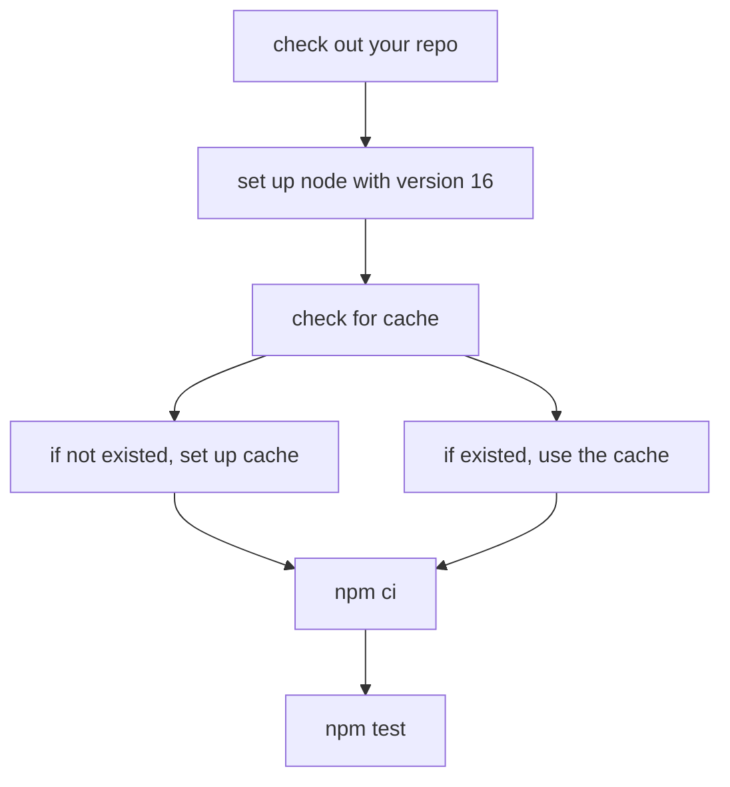
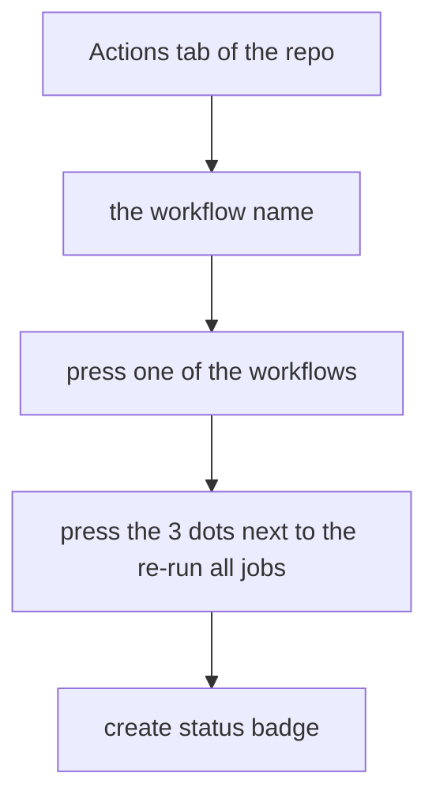

<!--truncate-->

## What is GitHub Actions?

> GitHub Actions is a continuous integration and continuous delivery (CI/CD) platform that allows you to automate your build, test, and deployment pipeline. You can create workflows that build and test every pull request to your repository, or deploy merged pull requests to production.
>
> From the Official Docs

In short, you automate these "boring" and repeated tasks without having to run it manually.

## How to write GitHub Actions?

It is written in YAML. It stands for `Yet Another Markup Language` at first and then evolved into `YAML Ain't Markup Language`.

In general, the structure looks like keys with values from top to bottom.

```yaml
key: value
```

YAML is pretty picky with indentation from my experience. I had a couple of times that action would not run due to incorrect indentation. 😑

Enough talk with stuff, let's see the setup!

## Workflows

Workflows files usually go in `.github/workflows` folder.

Let's see the Jest setup that I am using now.

```yaml
name: ci-jest
```

This is the name of the workflow. You could leave it empty, but it is better to have a name so you can see what it does in the `Actions` tab of the repo.


```yaml
on:
  pull_request:
    branches: [main]
```

This is the trigger for the workflows. It is like event listener in JavaScript. The workflow will only run based on parameters that you define with `on`. In this case, the workflow will run on the moment once you open `pull_request`. `branches` is a "sub-rule" to `pull_request`. This means the workflows will run when the PR is opened and will merge into the main branch.

There are more triggers you can do with `on` and I highly recommend check [Events that trigger workflows](https://docs.github.com/en/actions/using-workflows/events-that-trigger-workflows#push) out.

```yaml
jobs:
  jest:
    runs-on: ubuntu-latest
```

This is where you define and group the actions that you need to run the job named `jest`. You can define which OS to runs with, e.g. `ubuntu`, `macOS`, and `window`.

It is kinda similar to the package deal, and you will get whatever in the package.

```yaml
steps:
  - uses: actions/checkout@v3
  - uses: actions/setup-node@v3.5.1
    with:
      node-version: 16
      cache: "npm"
  - name: install and run jest test
    run: npm ci
  - run: npm test
```



`cache` is to enable faster installation for the process.

> In computing, a cache is a hardware or software component that stores data so that future requests for that data can be served faster; the data stored in a cache might be the result of an earlier computation or a copy of data stored elsewhere. according to [Cache(computing) wiki](<https://en.wikipedia.org/wiki/Cache_(computing)>)

Think this way, you are set up a brand new folder and needs packages. You are installing everything from the beginning and this takes time to install. Cache is to hold your installed package information for the future, and allow the installation process to be faster.

You can check how and what it runs by go to `Actions` tab of the repo. By the way, `min stack` is what I named for the PR.


If you are curious, you cna expand the dropdown and see what it does.


You also can set name for each `uses` action like below. Make sure there is no `-` for `uses`.

```yaml
- name: Setup Node.js environment
  uses: actions/setup-node@v3.5.1
```

I didn't set name, so it says `run actions/setup-node@v3.5.1` from the screenshot above. Once you set the name, you should see `Setup Node.js environment` instead.

### Overall workflows code

```yaml
name: ci-jest

on:
  pull_request:
    branches: [main]

jobs:
  jest:
    runs-on: ubuntu-latest
    steps:
      - uses: actions/checkout@v3
      - uses: actions/setup-node@v3.5.1
        with:
          node-version: 16
          cache: "npm"
      - name: install and run jest test
        run: npm ci
      - run: npm test
```

If you want to run with prettier, replace `npm test` with `npm format:fix` or whatever script name you are using.

Also, you could run 2 jobs in one file. Although, I am not sure if it is the best idea. It may be better to have one file for one job. Anyway, you could do this.

```yaml
name: ci-jest-prettier

on:
  pull_request:
    branches: [main]

jobs:
  jest: # job 1
    runs-on: ubuntu-latest
    steps:
      - uses: actions/checkout@v3
      - uses: actions/setup-node@v3.5.1
        with:
          node-version: 16
          cache: "npm"
      - name: install and run jest test
        run: npm ci
      # depend on what you name the script in package.json
      - run: npm test
  format: # job 2
    runs-on: ubuntu-latest
    steps:
      - uses: actions/checkout@v3
      - uses: actions/setup-node@v3.5.1
        with:
          node-version: 16
          cache: "npm"
      - name: install and run prettier
        run: npm ci
      # depend on what you name the script in package.jso
      - run: npm format:fix
```

## Recap

What I know about the workflows is a small tip of the iceberg. It can automate more things for you. I have seen a couple of workflows that can auto-assign labels for issues, run prettier, deploy, merge schedule and more things. I sometime go to any organizations or anyone's repos and check out their workflows under `.github/workflows` to see what they are automating.

A tip for you, try to click all clickable links in `Actions` tab to see where each of them lead to. You don't need to add any workflows now, but to get familiar with interface. I just did this again and found out that you can add badges for your GitHub Actions status.



> Note: for some reason, I cannot type "check" in the label box, so I used "press" instead. 😅


I hope this blog will help you to start with workflows quickly and start to automate repeated tasks for you!

## Resources

- [5 Ways to DevOps-ify your App - GitHub Actions Tutorial by Fireship](https://www.youtube.com/watch?v=eB0nUzAI7M8&t=1s)
  - I started with this video
- [YAML Tutorial: Everything You Need to Get Started in Minutes](https://www.cloudbees.com/blog/yaml-tutorial-everything-you-need-get-started)
- [Learn GitHub Actions - Official Docs](https://docs.github.com/en/actions/learn-github-actions/understanding-github-actions)
- [GitHub Actions Crash Course By Laith Academy](https://www.youtube.com/watch?v=1oJQRlz1v94)

## Thank you!

Thank you for your time and reading this!
