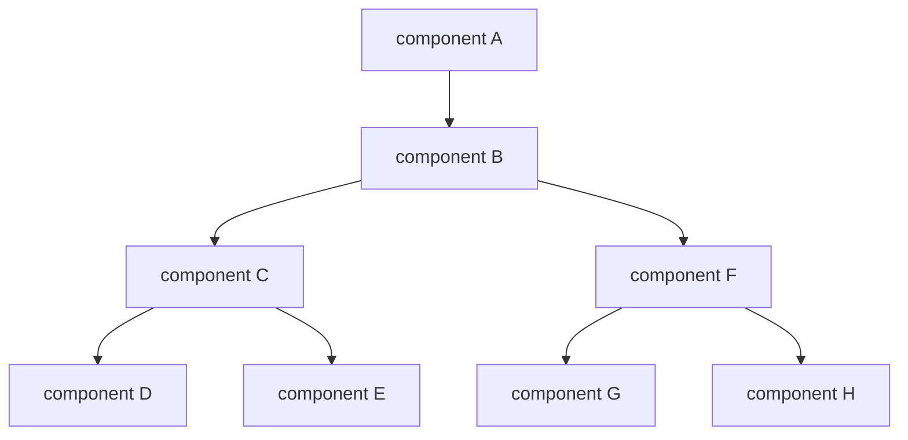

Let's learn about useContext Hook and how it helps with your React app!

<!--truncate-->

## What is useContext?

It is a hook in React that allows you to access context throughout your app globally within a functional component. Have you had an issue with where you need to pass props from a top-level component to lower-level components?

Let's start with its advantages and disadvantages.

Advantages:

- Easier to access context without the need to pass props down through multiple levels of the components tree
- Avoid the need to use prop drilling, a common pattern where props are passed from top to bottom through components that need the data
- A lean and efficient way to access context, as it only re-renders the component when the context value changes

Disadvantages:

- Can make it harder to understand the flow of data in a React application, as the context values are not passed down through props and are not visible in the component tree
- If the context value is changed, all components that use the context will re-render, which could lead the performance issues in large applications

## Props drilling



Props drilling is the process of passing data down through multiple levels of the component tree in order to reach a lower-level component that needs the data. For example, if component E needs data from the top-level component `component A`, you would need to pass the data through `component B` and `component C` before it reaches `component E`.

While this pattern is manageable in small and simple applications, it can make it difficult to understand the flow of data in a larger application and can make the code harder to maintain. It can also make it harder to reuse components.

## Re-render

One disadvantage of using the useContext hook is that when the context value changes, all the components that use the same context will re-render. This can be a problem in large applications, as it may cause performance issues.

For example, if you have a large app like a Trello board that uses a single context file to handle user authentication, kanban boards, and more, and a value in the context is changed, ALL the components that use the context will re-render.

To avoid this issue, it is a good idea to break the context down into smaller pieces, such as separate contexts for theme, user authentication, and user data. This way, you can limit the number of components that will re-render when a context value changes and improve the performance of your application.

## Code

Let's you have a hook that will fetch Todos from [JSON Placeholder](https://jsonplaceholder.typicode.com/todos).

```js showLineNumbers
// src/hooks/useFetchApi.jsx
import { useState, useEffect } from "react";

const useFetchApi = () => {
	const [data, setData] = useState([]);
	const [loading, setLoading] = useState(true);
	const [error, setError] = useState(null);

	useEffect(() => {
		const fetchData = async () => {
			const url = "https://jsonplaceholder.typicode.com/todos";
			try {
				const res = await fetch(url);
				const data = await res.json();
				setData(data);
			} catch (error) {
				setError(error);
			}
			setLoading(false);
		};

		fetchData();
	}, []);

	return { data, loading, error };
};

export default useFetchApi;
```

Steps:

- import `createContext` and `useConext` from react
- import `useFetchApi.jsx` (the fetch hook)
- Define `TodoContext` for `createContext()` at line 5
- Define `TodoProvider` function at line 7
- Define function(s) to filter data or whatever you need for the app
- Put that data that components need in `value` at line 14
- Define `useTodoContext` function that will return `useContext(TodoContext)` at line 20

```js showLineNumbers
// src/contexts/TodoContext.jsx
import { createContext, useContext } from "react";
import useFetchApi from "../hooks/useFetchState";

const TodoContext = createContext();

export function TodoProvider({ children }) {
	const { data, loading, error } = useFetchApi();

	// if you need to filter data for a search function or something,
	// you can define functions here and then add to the value below

	return <TodoContext.Provider value={{ data, error, loading }}>{children}</TodoContext.Provider>;
}

export function useTodoContext() {
	return useContext(TodoContext);
}
```

- Go to `App.jsx` (If you use CRA, you may have a different file name) or the file that defines the `function App()`
- Wrapping all your components with the `TodoProviders` at line 6
- If there are more than one context file, you can nest extra providers at line 7

```js showLineNumbers
// src/App.jsx
import { TodoProvider } from "./contexts/todoContext";

function App() {
	return (
		<TodoProvider>
			<SomeProvider>
				{/* if you have more than one context file, 
          you can nested provider(s) like this */}
				{/* your components or routes or anything */}
			</SomeProvider>
		</TodoProvider>
	);
}

export default App;
```

Remember this diagram?


To access todo data from `component G`, you can import the `useTodoContext` hook and destructure the data at line 5. For example:

```js showLineNumbers
// src/components/component G
import { useTodoContext } from "../contexts/todoContext";

function Todo() {
	const { data } = useTodoContext();

	return (
		<ul>
			{data.slice(0, 15).map((todo) => (
				<li key={todo.id}>
					<p>{todo.title}</p>
				</li>
			))}
		</ul>
	);
}

export default Todo;
```

This will allow you to access the todo data from the `TodoContext` in `component G`. That way, you don't have to pass props down from `component A` to `component G`.

```js
export function useTodoContext() {
	return useContext(TodoContext);
}
```

Additionally, if you don't have the `useTodoContext` defined in the `TodoContext.jsx`, you would need to write `const { data } = useContext(TodoContext)` in the code block above.

## Recap

The useContext hook is useful when you have data that needs to be accessed by multiple components at different levels of the component tree. It can help you avoid props drilling, a pattern where props are passed down through multiple levels of the component tree to reach a lower-level component that needs the data.

By using useContext, you can make your code more concise and maintainable. However, it's important to keep in mind that all components that use the context will re-render when the context value changes. To minimize unnecessary re-renders and improve performance, it's a good idea to keep the context as small as possible. Overall, useContext is a great tool for managing global context in a React application.

## Resources

- [useContext - React Docs (beta)](https://beta.reactjs.org/reference/react/useContext)

## Thank you!

Thank you for your time and for reading this!
